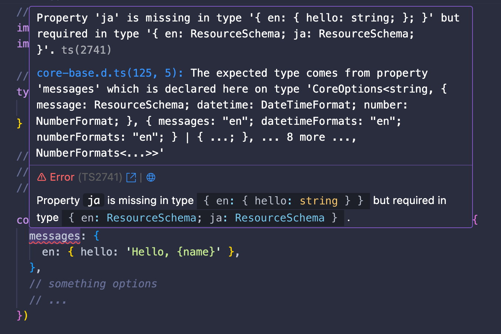

# @intlify/h3

[![npm version][npm-version-src]][npm-version-href]
[![npm downloads][npm-downloads-src]][npm-downloads-href]
[![CI][ci-src]][ci-href]

Internationalization middleware & utilities for h3

## 🌟 Features

✅️ &nbsp;**Translation:** Simple API like
[vue-i18n](https://vue-i18n.intlify.dev/)

✅ &nbsp;**Custom locale detector:** You can implement your own locale detector
on server-side

✅️️ &nbsp;**Useful utilities:** support internationalization composables
utilities via [@intlify/utils](https://github.com/intlify/utils)

## 💿 Installation

```sh
# Using npm
npm install @intlify/h3

# Using yarn
yarn add @intlify/h3

# Using pnpm
pnpm add @intlify/h3

# Using bun
bun add @intlify/h3
```

## 🚀 Usage

```ts
import { createServer } from 'node:http'
import { createApp, createRouter, eventHandler, toNodeListener } from 'h3'
import {
  defineI18nMiddleware,
  detectLocaleFromAcceptLanguageHeader,
  useTranslation,
} from '@intlify/h3'

// define middleware with vue-i18n like options
const middleware = defineI18nMiddleware({
  // detect locale with `accept-language` header
  locale: detectLocaleFromAcceptLanguageHeader,
  // resource messages
  messages: {
    en: {
      hello: 'Hello {name}!',
    },
    ja: {
      hello: 'こんにちは、{name}！',
    },
  },
  // something options
  // ...
})

// install middleware with `createApp` option
const app = createApp({ ...middleware })

const router = createRouter()
router.get(
  '/',
  eventHandler(async (event) => {
    // use `useTranslation` in event handler
    const t = await useTranslation(event)
    return t('hello', { name: 'h3' })
  }),
)

app.use(router)
createServer(toNodeListener(app)).listen(3000)
```

## 🛠️ Custom locale detection

You can detect locale with your custom logic from current `H3Event`.

example for detecting locale from url query:

```ts
import { defineI18nMiddleware, getQueryLocale } from '@intlify/h3'
import type { H3Event } from 'h3'

// define custom locale detector
const localeDetector = (event: H3Event): string => {
  return getQueryLocale(event).toString()
}

const middleware = defineI18nMiddleware({
  // set your custom locale detector
  locale: localeDetector,
  // something options
  // ...
})
```

You can make that function asynchronous. This is useful when loading resources along with locale detection.

> [!NOTE]
> The case which a synchronous function returns a promise is not supported. you need to use `async function`.

```ts
import { defineI18nMiddleware, getQueryLocale } from '@intlify/h3'
import type { DefineLocaleMessage } from '@intlify/h3'
import type { H3Event } from 'h3'

const loader = (path: string) => import(path).then((m) => m.default || m)
const messages: Record<string, () => ReturnType<typeof loader>> = {
  en: () => loader('./locales/en.json'),
  ja: () => loader('./locales/ja.json'),
}

// define custom locale detector and lazy loading
const localeDetector = async (event: H3Event, i18n: CoreContext<string, DefineLocaleMessage>): Promise<string> => {
  // detect locale
  const locale = getCookieLocale(event).toString()

  // resource lazy loading
  const loader = messages[locale]
  if (loader && !i18n.messages[locale]) {
    const message = await loader()
    i18n.messages[locale] = message
  }

  return locale
}

const middleware = defineI18nMiddleware({
  // set your custom locale detector
  locale: localeDetector,
  // something options
  // ...
})
```


## 🧩 Type-safe resources

> [!WARNING]
> **This is experimental feature (inspired from [vue-i18n](https://vue-i18n.intlify.dev/guide/advanced/typescript.html#typescript-support)).**
> We would like to get feedback from you 🙂.

> [!NOTE]
> The exeample code is [here](https://github.com/intlify/h3/tree/main/playground/typesafe-schema)

You can support the type-safe resources with schema using TypeScript on `defineI18nMiddleware` options.

Locale messages resource:

```ts
export default {
  hello: 'hello, {name}!'
}
```

your application code:

```ts
import { defineI18nMiddleware } from '@intlify/h3'
import { createApp } from 'h3'
import en from './locales/en.ts'

// define resource schema, as 'en' is master resource schema
type ResourceSchema = typeof en

const middleware = defineI18nMiddleware<[ResourceSchema], 'en' | 'ja'>({
  messages: {
    en: { hello: 'Hello, {name}' },
  },
  // something options
  // ...
})

const app = createApp({ ...middleware })
// someting your implementation code ...
// ...
```

Result of type checking with `tsc`:

```sh
npx tsc --noEmit
index.ts:13:3 - error TS2741: Property 'ja' is missing in type '{ en: { hello: string; }; }' but required in type '{ en: ResourceSchema; ja: ResourceSchema; }'.

13   messages: {
     ~~~~~~~~

  ../../node_modules/@intlify/core/node_modules/@intlify/core-base/dist/core-base.d.ts:125:5
    125     messages?: {
            ~~~~~~~~
    The expected type comes from property 'messages' which is declared here on type 'CoreOptions<string, { message: ResourceSchema; datetime: DateTimeFormat; number: NumberFormat; }, { messages: "en"; datetimeFormats: "en"; numberFormats: "en"; } | { ...; }, ... 8 more ..., NumberFormats<...>>'


Found 1 error in index.ts:13
```

If you are using [Visual Studio Code](https://code.visualstudio.com/) as an editor, you can notice that there is a resource definition omission in the editor with the following error before you run the typescript compilation.




## 🖌️ Resource keys completion

> [!WARNING]
> **This is experimental feature (inspired from [vue-i18n](https://vue-i18n.intlify.dev/guide/advanced/typescript.html#typescript-support)).**
> We would like to get feedback from you 🙂.

> [!NOTE]
> Resource Keys completion can be used if you are using [Visual Studio Code](https://code.visualstudio.com/)

You can completion resources key on translation function with `useTranslation`.


resource keys completion has twe ways.

### Type parameter for `useTranslation`

> [!NOTE]
> The exeample code is [here](https://github.com/intlify/h3/tree/main/playground/local-schema)

You can `useTranslation` set the type parameter to the resource schema you want to key completion of the translation function.

the part of example:
```ts
const router = createRouter()
router.get(
  '/',
  eventHandler(async (event) => {
    type ResourceSchema = {
      hello: string
    }
    // set resource schema as type parameter
    const t = await useTranslation<ResourceSchema>(event)
    // you can completion when you type `t('`
    return t('hello', { name: 'h3' })
  }),
)
```

### global resource schema with `declare module '@intlify/h3'`

> [!NOTE]
> The exeample code is [here](https://github.com/intlify/h3/tree/main/playground/global-schema)

You can do resource key completion with the translation function using the typescript `declare module`.

the part of example:
```ts
import en from './locales/en.ts'

// 'en' resource is master schema
type ResourceSchema = typeof en

// you can put the type extending with `declare module` as global resource schema
declare module '@intlify/h3' {
  // extend `DefineLocaleMessage` with `ResourceSchema`
  export interface DefineLocaleMessage extends ResourceSchema {}
}

const router = createRouter()
router.get(
  '/',
  eventHandler(async (event) => {
    const t = await useTranslation(event)
    // you can completion when you type `t('`
    return t('hello', { name: 'h3' })
  }),
)

```

The advantage of this way is that it is not necessary to specify the resource schema in the `useTranslation` type parameter.


## 🛠️ Utilites & Helpers

`@intlify/h3` has a concept of composable utilities & helpers.

### Utilities

`@intlify/h3` composable utilities accept event (from
`eventHandler((event) => {})`) as their first argument. (Exclude `useTranslation`) return the [`Intl.Locale`](https://developer.mozilla.org/en-US/docs/Web/JavaScript/Reference/Global_Objects/Intl/Locale)

### Translations

- `useTranslation(event)`: use translation function, asynchronous

### Headers

- `getHeaderLocale(event, options)`: get locale from `accept-language` header
- `getHeaderLocales(event, options)`: get some locales from `accept-language` header
- `tryHeaderLocale(event, options)`: try to get locale from `accept-language` header
- `tryHeaderLocales(event, options)`: try to get some locales from `accept-language` header

### Cookies

- `getCookieLocale(event, options)`: get locale from cookie
- `tryCookieLocale(event, options)`: try to get locale from cookie
- `setCookieLocale(event, options)`: set locale to cookie

### Misc

- `getPathLocale(event, options)`: get locale from path
- `tryPathLocale(event, options)`: try to get locale from path
- `getQueryLocale(event, options)`: get locale from query
- `tryQueryLocale(event, options)`: try to get locale from query

## Helpers

- `detectLocaleFromAcceptLanguageHeader(event)`: detect locale from `accept-language` header

## 🙌 Contributing guidelines

If you are interested in contributing to `@intlify/h3`, I highly recommend checking out [the contributing guidelines](/CONTRIBUTING.md) here. You'll find all the relevant information such as [how to make a PR](/CONTRIBUTING.md#pull-request-guidelines), [how to setup development](/CONTRIBUTING.md#development-setup)) etc., there.

## ©️ License

[MIT](http://opensource.org/licenses/MIT)

<!-- Badges -->

[npm-version-src]: https://img.shields.io/npm/v/@intlify/h3?style=flat&colorA=18181B&colorB=FFAD33
[npm-version-href]: https://npmjs.com/package/@intlify/h3
[npm-downloads-src]: https://img.shields.io/npm/dm/@intlify/h3?style=flat&colorA=18181B&colorB=FFAD33
[npm-downloads-href]: https://npmjs.com/package/@intlify/h3
[ci-src]: https://github.com/intlify/utils/actions/workflows/ci.yml/badge.svg
[ci-href]: https://github.com/intlify/utils/actions/workflows/ci.yml
